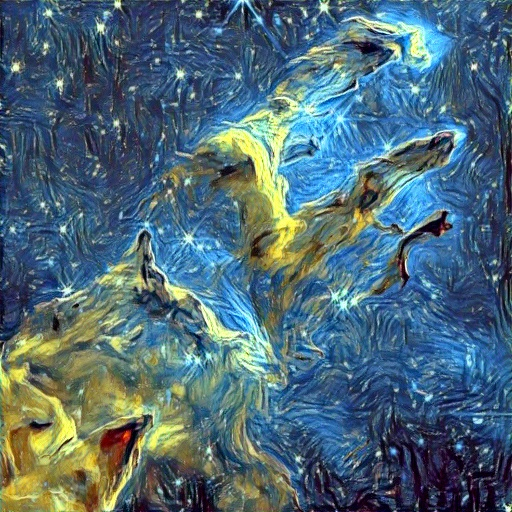
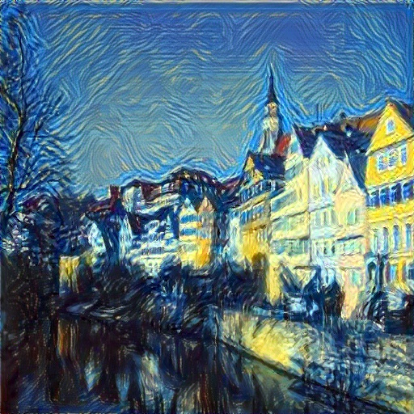

# 🚀Project Guide

Style Transfer is a real-time fast image style transfer algorithm platform based on the combination of Fast Neural Style Transfer and MetaNet. The APP mainly includes two main functions: fixed migration uses the Fast Neural Style Transfer algorithm to transfer the content image and style image selected by the user in a fixed direction. At the same time, the user can choose the degree of migration to determine the degree of style transfer. This function is limited to the image transfer with high accuracy of style transfer. Note that it is not suitable for video; dynamic migration uses MetaNet and TransformNet two models to perform real-time style transfer on the video obtained by the camera. Users can first select any style of image. After clicking Dynamic Transfer, they can perform real-time style transfer. At the same time, this project is a software framework based on the work of [Open Source Author](https://github.com/CortexFoundation/StyleTransferTrilogy) and reproduces the original author's epic style migration model. If you also want to use this model weight, you can download it through the following link:


```bash
# you can download the model weights from here:
通过网盘分享的文件：style_transfer
链接: https://pan.baidu.com/s/18clgCae4K7aFrrtLK1OqEA?pwd=imne 提取码: imne
```

## 🎉model introduction

___Fast Neural Style Transfer___ is an image generation technology based on deep learning, which aims to quickly transfer the style of the target image to the content image and generate a new image with both content and style characteristics. Its core breakthrough lies in the training mechanism of the feedforward network, which is hundreds of times faster than the traditional iterative optimization style transfer method (such as the original algorithm proposed by Gatys), and can achieve real-time generation effects.

___network architecture___：Adopt encoding-decoding architecture, composed of residual convolutional blocks (ResBlock). The encoding stage compresses features through convolution and downsampling, and the decoding stage restores resolution through upsampling and convolution.
• Residual module: Each ResBlock contains a convolutional layer, instance normalization (InstanceNorm), and ReLU activation to enhance the network's ability to express features.
• Upsampling method: Use bilinear interpolation or nearest neighbor interpolation instead of deconvolution to reduce checkerboard artifacts.
The input is a content image (e.g. 256 × 256 × 3), and the output is a stylized image (same size). The network weights are fixed after training, and the inference requires only one forward propagation to generate the result.
___loss function___：The loss function of Fast Neural Style Transfer is composed of three parts: content loss, style loss, and total variation loss. The content loss measures the difference between the feature maps of the content image and the stylized image, and the style loss measures the difference between the feature maps of the style image and the stylized image. The total variation loss is used to prevent the stylized image from becoming too blurry or too smooth. The total loss is the sum of these three parts, and thenetwork is trained to minimize the total loss.

```bash
# Content Loss: Calculate the mean square error (MSE) between the feature 
# maps of the generated image and the content image at high levels of VGG 
# (such as relu4_2 layer) to ensure the preservation of content semantics.
content_loss = MSE(VGG(content_img), VGG(generated_img))  


# Style Loss: Based on the Gram matrix (feature correlation matrix), 
# calculate the feature differences between the generated image and the 
# style image in multiple VGG layers (such as relu1_1, relu2_1, etc.). 
# The Gram matrix reflects the texture distribution and captures style features.
def gram_matrix(features):
    _, c, h, w = features.size() 
    flattened = features.view(c,  h * w)
    return torch.mm(flattened,  flattened.t())
style_loss = MSE(gram(style_img), gram(generated_img))


# Total Variation Loss: Calculate the sum of the absolute differences 
# between adjacent pixel values in the generated image, which can 
# prevent the generated image from becoming too smooth or blurry.
total_loss = λ_content * content_loss + λ_style * style_loss + λ_tv * tv_loss  
```

___MetaNet and TransformNet___MetaNet and TransformNet are two important models in the field of image style transfer, representing the design concepts of meta-learning framework and fast style transfer network respectively. The following are their core principles and technical characteristics, The weights of the pink part are generated by MetaNet, while the weights of the gray part are trained together with MetaNet:


```bash
# the TransformNet architecture is as follows
# you can see it in the ./models/MetaNet_Random_Style_Transfer.py
class TransformNet(nn.Module):
    def __init__(self, base=8):
        super(TransformNet, self).__init__()
        self.base = base
        self.weights = []
        self.downsampling = nn.Sequential(
            *ConvLayer(3, base, kernel_size=9, trainable=True), 
            *ConvLayer(base, base*2, kernel_size=3, stride=2), 
            *ConvLayer(base*2, base*4, kernel_size=3, stride=2), )
        
        self.residuals = nn.Sequential(*[ResidualBlock(base*4) for i in range(5)])
        self.upsampling = nn.Sequential(
            *ConvLayer(base*4, base*2, kernel_size=3, upsample=2),
            *ConvLayer(base*2, base, kernel_size=3, upsample=2),
            *ConvLayer(base, 3, kernel_size=9, instance_norm=False, relu=False, trainable=True),)
        self.get_param_dict()
    def forward(self, X):
        y = self.downsampling(X)
        y = self.residuals(y)
        y = self.upsampling(y)
        return y
```

MetaNet consists of two subnetworks, it enables the model to quickly adapt to new styles and solve the problem that traditional methods need to be trained separately for each style:
• Basic network (e.g. TransformNet): Perform style migration tasks.
• Meta Network: weighting parameters of the underlying network based on input style image generation

```bash
# the MetaNet architecture is as follows
# you can see it in the ./models/MetaNet_Random_Style_Transfer.py
class MetaNet(nn.Module):
    """实现MetaNet网络结构"""
    def __init__(self, param_dict):
        super(MetaNet, self).__init__()
        self.param_num = len(param_dict)
        self.hidden = nn.Linear(1920, 128*self.param_num)
        self.fc_dict = {}
        for i, (name, params) in enumerate(param_dict.items()):
            self.fc_dict[name] = i
            setattr(self, 'fc{}'.format(i+1), nn.Linear(128, params))
    
    def forward(self, mean_std_features):
        hidden = F.relu(self.hidden(mean_std_features))
        filters = {}
        for name, i in self.fc_dict.items():
            fc = getattr(self, 'fc{}'.format(i+1))
            filters[name] = fc(hidden[:,i*128:(i+1)*128])
        return filters
```

## 💡Result analysis

The results of the Fast Neural Style Transfer model are as follows:
Fast Neural Style Transfer:

| Content Image 1 | Content Image 2 | Style Image |
|----------------|-----------------|--------------|
|  |  |  |

| Stylized 200 | Stylized 400 | Stylized 600 | Stylized 800 |
| ------------- | ------------- | ------------- | ------------- |
|  |  |  |  |
|  |  |  |  |

MetaNet and TransformNet:

|  |  |  |  |
| ------------- | ------------- | ------------- |  ------------- |
|  |  |  |  |
